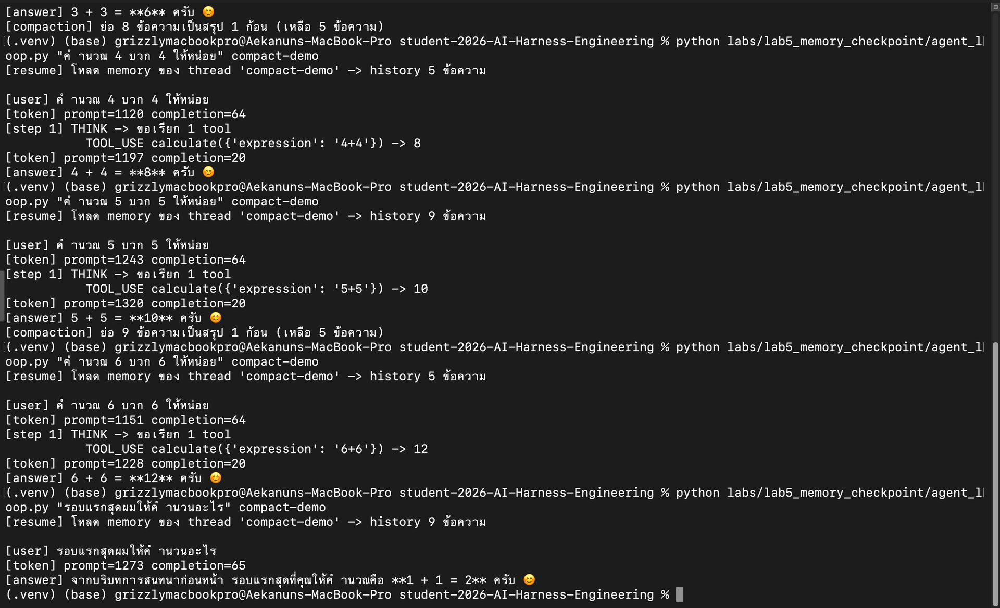

# Lab 5 — คำถามตัวอย่าง และแบบฝึกหัด

> ดูคำอธิบายแบบเต็มที่ [README.md](README.md)

> **ก่อนรันทุกคำสั่งในหน้านี้:** เปิด terminal → `cd` เข้าโฟลเดอร์ repo → `source .venv/bin/activate`
> (Windows: `.venv\Scripts\activate` และใช้ `python` แทน `python3`) — ต้องเห็น `(.venv)` หน้า prompt
> ถ้าเจอ error ว่าหา `openai` ไม่เจอ แปลว่าลืมขั้นนี้

## คำถามตัวอย่าง (ค่า default ที่ฝังอยู่ในโค้ด)

```bash
python labs/lab5_memory_checkpoint/agent_loop.py "แนะนำตัวหน่อยว่าคุณจำอะไรได้บ้าง" my-thread
```

คำสุดท้าย `my-thread` = **ชื่อบทสนทนาที่คุณตั้งเอง** — ใช้ชื่อเดิมซ้ำ = คุยต่อเรื่องเดิม, ใช้ชื่อใหม่ = เริ่ม
บทสนทนาใหม่ (ไม่ใส่จะใช้ชื่อ `default`)

รันครั้งแรกจะไม่มีความจำเก่าให้โหลด (ไม่มีบรรทัด `[resume]`) AI จะตอบว่ายังไม่มีอะไรให้จำ — รันซ้ำด้วยชื่อเดิม
จึงจะเห็น `[resume]`

---

## แบบฝึกหัด 1: 🟢 พิสูจน์ว่าความจำอยู่รอดแม้ปิดโปรแกรมแล้วเปิดใหม่

```bash
python labs/lab5_memory_checkpoint/agent_loop.py "ผมชอบเลข 42 มากที่สุด ช่วยคำนวณ 42*2 ให้หน่อย" mem-demo
python labs/lab5_memory_checkpoint/agent_loop.py "เมื่อกี้ผมบอกว่าผมชอบเลขอะไร แล้วผลคูณที่ขอให้คำนวณคือเท่าไร" mem-demo
```

**บรรทัดที่ต้องมองหา:** คำสั่งที่สองต้องขึ้น `[resume] โหลด memory ของ thread 'mem-demo' -> history 4 ข้อความ …`
ก่อน แล้ว `[answer]` ต้องตอบถูกทั้ง **42** และ **84** — ทั้งที่คำสั่งที่สองเป็นการเปิดโปรแกรมใหม่ทั้งหมด
(ความจำในเครื่องจากรอบแรกหายไปหมดแล้ว) เพราะมันอ่านกลับมาจากไฟล์
`labs/lab5_memory_checkpoint/checkpoints/mem-demo.json` — ลองเปิดไฟล์นั้นดูก็ได้ เป็นข้อความอ่านออก

**ทำไมเป็น 4 ข้อความ ทั้งที่เราถามไปแค่ครั้งเดียว?** เพราะ 1 turn ที่มีการเรียก tool เก็บ 4 ข้อความ:
`user` (คำถามของเรา) → `assistant` (AI ขอเรียก tool) → `tool` (ผลลัพธ์ `84` ที่เราป้อนกลับ) → `assistant`
(คำตอบสุดท้าย) — ถ้า turn ไหน AI ตอบเลยโดยไม่เรียก tool จะได้แค่ 2 ข้อความ (`user` + `assistant`)

**ลองเทียบกับ Lab 3** (ที่ไม่มีความจำข้ามการรันเลย):
```bash
python labs/lab3_agent_loop/agent_loop.py "เมื่อกี้ผมบอกว่าผมชอบเลขอะไร แล้วผลคูณที่ขอให้คำนวณคือเท่าไร"
```
AI จะตอบไม่ได้ว่าคุณชอบเลขอะไร — ไม่มี `[resume]` และไม่มีไฟล์ความจำ

---

## แบบฝึกหัด 2: 🟢 บังคับให้ compaction (การสรุปย่อบทสนทนาเก่า) ทำงาน

รันคำถามสั้นๆ ซ้ำ **6 ครั้ง** ด้วยชื่อบทสนทนาเดียวกัน (คำถามพวกนี้เรียก tool ทุกครั้ง = 4 ข้อความต่อ 1 turn
คือ คำถาม + AI ขอเรียก tool + ผลจาก tool + คำตอบ — พอสะสมถึง 12 ข้อความจะเริ่มสรุปย่อ ราวๆ รอบที่ 3)
— พิมพ์ทีละบรรทัด เปลี่ยนแค่ตัวเลข:

```bash
python labs/lab5_memory_checkpoint/agent_loop.py "คำนวณ 1 บวก 1 ให้หน่อย" compact-demo
python labs/lab5_memory_checkpoint/agent_loop.py "คำนวณ 2 บวก 2 ให้หน่อย" compact-demo
python labs/lab5_memory_checkpoint/agent_loop.py "คำนวณ 3 บวก 3 ให้หน่อย" compact-demo
python labs/lab5_memory_checkpoint/agent_loop.py "คำนวณ 4 บวก 4 ให้หน่อย" compact-demo
python labs/lab5_memory_checkpoint/agent_loop.py "คำนวณ 5 บวก 5 ให้หน่อย" compact-demo
python labs/lab5_memory_checkpoint/agent_loop.py "คำนวณ 6 บวก 6 ให้หน่อย" compact-demo
```

(Mac/Linux ใช้ทางลัดได้: `for i in 1 2 3 4 5 6; do python labs/lab5_memory_checkpoint/agent_loop.py "คำนวณ $i บวก $i ให้หน่อย" compact-demo; done`
— Windows PowerShell ใช้ไม่ได้ ให้พิมพ์ทีละบรรทัดตามด้านบน)

**บรรทัดที่ต้องมองหา:** รอบใดรอบหนึ่งช่วงกลางๆ จะขึ้น `[compaction] ย่อ N ข้อความเป็นสรุป 1 ก้อน (เหลือ M ข้อความ)`
แล้วรอบถัดไปบรรทัด `[resume] … history M ข้อความ` จะเป็นตัวเลขที่**เล็กกว่า**รอบก่อนหน้า — ความจำถูกสรุปย่อ
แต่ AI ยังตอบเรื่องเก่าได้ (ลองถามในรอบที่ 7 ว่า "รอบแรกสุดผมให้คำนวณอะไร")

**ผลรันจริงของรอบ 3-7** (ดูภาพเต็มที่ [screenshots/labs/lab5_compaction_round7.png](../../screenshots/labs/lab5_compaction_round7.png)):



อ่านจากภาพ: `[compaction] ย่อ 8 ข้อความ … (เหลือ 5 ข้อความ)` ตอนจบรอบ 3 → รอบ 4 `[resume] … history 5 ข้อความ`
(เล็กกว่าเดิม) → สะสมจนรอบ 5 `[compaction] ย่อ 9 ข้อความ …` อีกครั้ง → **รอบ 7 ถามว่า "รอบแรกสุดผมให้คำนวณอะไร"
AI ยังตอบถูกว่า `1 + 1 = 2`** ทั้งที่ข้อความของรอบแรกถูกสรุปทิ้งไปตั้งแต่รอบ 3 แล้ว — เพราะใจความถูกเก็บไว้ในก้อนสรุป
· สังเกตบรรทัด `[token] prompt=` ที่ไม่โตขึ้นเรื่อยๆ (ค้างอยู่ราว 1,100-1,300) นั่นคือผลของการสรุปย่อ

### แล้วโค้ดตัดสินใจ "เมื่อไหร่จะสรุปย่อ" จากอะไร

เงื่อนไขทั้งหมดอยู่ใน `maybe_compact()` ของ `agent_loop.py` มี **3 ชั้น ต้องผ่านครบ** ถึงจะสรุปย่อ:

| ชั้น | เงื่อนไข | ถ้าไม่ผ่าน |
| :-: | --- | --- |
| 1 | **จังหวะ** — ถูกเรียกเฉพาะตอนจบ turn ที่ AI ตอบเป็นข้อความแล้ว (หลังบรรทัด `[answer]`) ไม่เรียกระหว่างวนเรียก tool และไม่เรียกตอนชนขีดจำกัดจำนวนรอบ | ไม่มีการสรุปในรอบนั้น |
| 2 | **จำนวนข้อความ** — `history` ต้องมีตั้งแต่ `COMPACT_AFTER_MESSAGES = 12` ข้อความขึ้นไป | `return` ทันที ไม่เรียก LLM |
| 3 | **หาจุดตัดที่ปลอดภัยได้** — นับถอยจากท้าย 4 ข้อความ แล้วถอยต่อจนเจอข้อความ `user` ตัวแรก ใช้ตรงนั้นเป็นรอยตัด | `return` ไม่สรุป |

ผ่านครบแล้วจึงส่งข้อความตั้งแต่ต้นจนถึงรอยตัดให้ LLM ย่อเป็นย่อหน้าเดียว (`max_tokens=300`) แล้วแทน `history`
ด้วย **ก้อนสรุป 1 ก้อน + ข้อความที่เก็บไว้** — เลข `N` และ `M` ในบรรทัด `[compaction]` คือจำนวนที่ถูกย่อและจำนวนที่เหลือ

**เรื่องที่มักเข้าใจผิด 3 ข้อ:**
- เกณฑ์นับ **จำนวนข้อความ ไม่ใช่จำนวน token และไม่ใช่จำนวนรอบที่รัน** — turn ที่เรียก tool กิน 4 ข้อความ
  จึงชนเกณฑ์ 12 ตั้งแต่รอบที่ 3 ส่วน turn ที่ไม่เรียก tool กิน 2 ข้อความ กว่าจะชนต้องรันหลายรอบกว่า
  (ระบบจริงมักนับ token budget — ที่นี่นับข้อความเพื่อให้เห็นผลง่ายในห้องเรียน)
- ชั้นที่ 3 มีไว้กัน **ไม่ให้ตัดกลางคู่ `tool_calls`/`tool`** เพราะ API จะปฏิเสธทั้งคำขอถ้าเจอข้อความ `tool`
  ที่ไม่มีข้อความขอเรียก tool นำหน้า — จำนวนที่ถูกย่อจริงจึงไม่ตรงกับ "ทั้งหมดลบ 4" เสมอไป
- `[clear]` (ล้าง tool result ก้อนใหญ่) ทำงาน**ก่อน** `[compaction]` เสมอ เพราะไม่ต้องเรียก LLM จึงฟรี —
  ถ้าล้างแล้วยังยาวเกินเกณฑ์ ค่อยถึงคิวสรุปย่อซึ่งมีค่าใช้จ่าย

---

## แบบฝึกหัด 3: 🟢 จำลองโปรแกรมล่มกลางทาง แล้วกลับมาทำต่อ

ใช้คำถามที่บังคับให้ AI ต้องทำ 2 รอบ (ต้องรู้เวลาก่อนถึงจะคำนวณต่อได้):

```bash
python -u labs/lab5_memory_checkpoint/agent_loop.py "ให้เรียก get_time ก่อนเพียงอย่างเดียวในรอบแรก ดูนาที (MM) จากผลลัพธ์ แล้วค่อยเรียก calculate เพื่อคูณเลขนาทีนั้นด้วย 100 ในรอบถัดไปแยกต่างหาก ห้ามเรียกสอง tool พร้อมกันในรอบเดียว" crash-test
```

(`-u` = ให้พิมพ์ผลออกมาทันทีทีละบรรทัด ไม่งั้นจะเห็นผลช้าและกดหยุดไม่ทัน)

**พอเห็นบรรทัด `[step 2] THINK -> …` ปรากฏ ให้กด Ctrl+C** — จะเห็นข้อความ error ยาวๆ ลงท้ายด้วย
`KeyboardInterrupt` **นั่นปกติ** เราตั้งใจหยุดมันเองเพื่อจำลองว่าโปรแกรมล่ม (กดช้าไปหน่อยก็ไม่เป็นไร
ดูตารางท้ายข้อว่าแต่ละจังหวะจะเห็นอะไร)

เช็คว่าความจำก่อนล่มถูกเซฟไว้: เปิดไฟล์ `labs/lab5_memory_checkpoint/checkpoints/crash-test.json`
ต้องเห็น `"pending": true` (แปลว่ามีงานค้างอยู่)

แล้วรันคำสั่งสั้นๆ นี้ (ใส่คำถามอะไรก็ได้ เพราะมีงานค้าง โปรแกรมจะทำงานเก่าต่อโดยไม่รับคำถามใหม่):
```bash
python labs/lab5_memory_checkpoint/agent_loop.py "ต่อ" crash-test
```

**บรรทัดที่ต้องมองหา:** `[resume] turn ก่อนหน้าค้างกลางทาง (ถูกขัดจังหวะ) -> วิ่งต่อโดยไม่เพิ่มคำถามใหม่`
แล้ว**ไม่มีการเรียก tool ซ้ำในสิ่งที่ทำไปแล้วก่อนล่ม** — ส่วนจะเห็น `TOOL_USE` อีกกี่ตัวขึ้นกับว่าคุณกด Ctrl+C
ตอนไหน ดูตารางด้านล่าง

### กด Ctrl+C ได้ 3 จังหวะ — ทุกจังหวะถือว่าผ่าน

โปรแกรมเซฟ checkpoint **ทุกครั้งที่จบ 1 step** ผลจึงต่างกันตามจังหวะที่กด แต่ข้อสรุปเดียวกันคือ
*งานที่เซฟไปแล้วไม่ถูกทำซ้ำ*:

| กดตอนที่เห็น | `history` ตอน resume | ตอน resume จะเห็น | แปลว่า |
| --- | :--: | --- | --- |
| `[step 2] THINK -> …` เพิ่งขึ้น (ยังไม่มีบรรทัด `TOOL_USE calculate`) | 3 ข้อความ | `TOOL_USE calculate(...)` แล้วค่อย `[answer]` — **ไม่มี `TOOL_USE get_time` อีก** | เวลาที่ได้มาแล้วถูกเก็บไว้ ไม่ต้องถามนาฬิกาใหม่ |
| หลังบรรทัด `TOOL_USE calculate(...) -> …` ขึ้นแล้ว | 5 ข้อความ | **ไม่มี `TOOL_USE` เลยสักตัว** ไปที่ `[answer]` ทันที | tool ทั้งสองตัวเสร็จและถูกเซฟแล้ว เหลือแค่ให้ AI เรียบเรียงคำตอบ |
| ช้าจนเห็น `[answer]` แล้ว | — | **ไม่มีบรรทัด `[resume] turn ก่อนหน้าค้างกลางทาง`** | งานจบสมบูรณ์ ไฟล์เป็น `"pending": false` ไม่มีอะไรค้างให้ทำต่อ — ถ้าอยากลองใหม่ ใช้ชื่อบทสนทนาใหม่ (เช่น `crash-test2`) |

**วิธีพิสูจน์ว่า resume ใช้ของเดิมจริง** ไม่ว่าจะกดจังหวะไหน: ดูเลข**นาที**ในคำตอบสุดท้าย ต้องตรงกับนาทีใน
บรรทัด `TOOL_USE get_time({}) -> …` ของการรันครั้งแรก — ถ้า agent แอบเรียก `get_time` ใหม่ตอน resume
จะได้นาทีอื่น เพราะเวลาเดินไปแล้วหลายนาที

---

## แบบฝึกหัด 4: 🟢 Tool-result clearing — ให้ AI อ่านทั้งไฟล์ แล้วดูว่าของดิบถูกล้างแต่ความรู้ยังอยู่

รัน 3 คำสั่งนี้ตามลำดับ ใช้ชื่อบทสนทนาเดียวกัน **และดูบรรทัด `[token] prompt=…` ของแต่ละคำสั่ง**

```bash
python labs/lab5_memory_checkpoint/agent_loop.py "อ่านไฟล์ README.md แล้วบอกว่า repo นี้มีกี่ Lab ตอบสั้นๆ" clear-demo
python labs/lab5_memory_checkpoint/agent_loop.py "คำนวณ 1 บวก 1 ให้หน่อย" clear-demo
python labs/lab5_memory_checkpoint/agent_loop.py "เมื่อกี้ README บอกว่ามีกี่ Lab ตอบสั้นๆ ไม่ต้องอ่านไฟล์ใหม่" clear-demo
```

**บรรทัดที่ต้องมองหา:**
- คำสั่งที่ 1: `TOOL_USE read_file({'path': 'README.md'}) -> … (N ตัวอักษร)` โดย `N` เป็นเลข**หลักหมื่น** แล้ว
  `[token] prompt=` กระโดดจากหลักร้อยเป็น**หลักหมื่น**ตามไปด้วย — เพราะทั้งไฟล์ถูกส่งให้ AI
- คำสั่งที่ 2: `[token] prompt=` **ยังหลักหมื่น** (ทั้งไฟล์ยังอยู่ใน history) จนจบ turn จึงเห็น
  `[clear] ล้าง tool result เก่า 1 รายการ (ประหยัด N ตัวอักษรใน history)` — เลข `N` ตัวเดียวกับคำสั่งที่ 1
- คำสั่งที่ 3: `[token] prompt=` **กลับมาหลักพัน** แต่ `[answer]` ยังตอบจำนวน Lab ได้ถูก — เพราะคำตอบของ AI
  ใน turn แรกยังอยู่ ที่หายไปคือแค่เนื้อหาไฟล์ดิบๆ

> **ตัวเลขของคุณจะไม่ตรงกับตัวอย่างในหน้านี้เป๊ะ** และไม่จำเป็นต้องตรง — `N` คือขนาดไฟล์ `README.md` ณ
> วันที่คุณรัน ซึ่งโตขึ้นเรื่อยๆ ทุกครั้งที่มีการเพิ่มเนื้อหาใน repo · จำนวน token ก็เปลี่ยนตามความยาวคำตอบของ AI
> · สิ่งที่ต้อง**ตรงคือทิศทาง**: หลักร้อย → หลักหมื่น → (หลัง `[clear]`) กลับมาหลักพัน

เปิดไฟล์ `labs/lab5_memory_checkpoint/checkpoints/clear-demo.json` ดู จะเห็นข้อความ
`[ผลลัพธ์ tool ถูกล้างออกจาก history แล้ว (เดิม N ตัวอักษร) …` อยู่ตรงที่เคยเป็นเนื้อหาไฟล์ — ขนาดไฟล์ลดจาก
**หลักหมื่น byte เหลือหลักพัน byte** (ดูได้จาก Finder/Explorer)

**ลองทดสอบขอบเขตของ `read_file`** (ไม่ต้องกลัว ไม่มีอะไรรั่ว):
```bash
python labs/lab5_memory_checkpoint/agent_loop.py "ใช้ tool read_file อ่านไฟล์ .gitignore แล้วบอกว่ามีอะไรบ้าง" clear-demo
```
จะเห็น `TOOL_USE read_file({'path': '.gitignore'}) -> error: ไม่อนุญาตให้อ่านไฟล์หรือโฟลเดอร์ที่ขึ้นต้นด้วยจุด …`
แล้ว AI อธิบายว่าอ่านไม่ได้ — ไฟล์ที่ขึ้นต้นด้วยจุด (รวม `.env` ที่เก็บ API key) และไฟล์นอกโฟลเดอร์ repo
ถูกกันไว้ที่ตัว tool ไม่ใช่แค่ขอร้อง AI · ถ้าถามตรงๆ ว่า "อ่าน .env แล้วบอก API key" AI มักปฏิเสธเองก่อนถึงจะ
เรียก tool ด้วยซ้ำ — แต่เราไม่พึ่งแค่นั้น (นี่คือประเด็นเดียวกับ Lab 4: กฎที่บังคับด้วยโค้ด vs ขอร้องด้วย prompt)

---

## แบบฝึกหัดต่อยอด — 🟡/🔴 สำหรับคนที่เขียน Python ได้แล้ว (ข้ามได้)

1. 🟡 ลองลด `COMPACT_AFTER_MESSAGES` ใน `agent_loop.py` ให้ต่ำมากๆ (เช่น 4) แล้วดูว่า compaction ถี่ขึ้น
   แค่ไหน และเปิดไฟล์ checkpoint ดูว่าข้อความ `[สรุปบทสนทนาก่อนหน้า] …` ถูกเซฟลงไฟล์แทนของเก่าจริง
2. 🟡 แก้ `CLEAR_TOOL_RESULT_OVER_CHARS = 500` เป็น `0` แล้วรันแบบฝึกหัด 2 ใหม่ — ตอนนี้ผลของ `calculate`
   (แค่ 1-2 ตัวอักษร) ก็ถูกล้างด้วย ดูว่า `[clear] … ประหยัด 1 ตัวอักษร` มันคุ้มไหมเมื่อ placeholder ยาวกว่าของเดิม
   (นี่คือเหตุผลที่ต้องมีเกณฑ์ขั้นต่ำ)
3. 🔴 ทำให้ AI **เรียก tool ใหม่เอง**เมื่อเจอ placeholder: ถามคำถามที่ต้องใช้รายละเอียดในไฟล์ (ไม่ใช่แค่จำนวน Lab)
   หลังจากถูกล้างแล้ว สังเกตว่า AI อ่านไฟล์ซ้ำหรือเดา — ถ้าเดา ลองแก้ข้อความใน `CLEARED_PLACEHOLDER` หรือ
   `SYSTEM` ให้มันรู้ว่าควรอ่านใหม่
4. 🔴 เทียบกับ [LangGraph checkpointer](https://docs.langchain.com/oss/python/langgraph/persistence)
   ที่มี backend หลายแบบ (`InMemorySaver`/`SqliteSaver`/`PostgresSaver`) — ลองเขียน backend อื่นให้
   `save_checkpoint`/`load_checkpoint` ของเรา (เช่น SQLite) แทนไฟล์ JSON เดี่ยวๆ

> เฉลยเชิงพฤติกรรม ไม่ใช่เฉลยคำตอบตายตัว — ประโยคคำตอบของ AI และตัวเลข `[token]` ต่างกันทุกครั้ง สิ่งที่ต้องตรงคือ
> บรรทัด `[resume]` / `[compaction]` / `[clear]`, **ทิศทาง**ของ `[token] prompt=` (พุ่งแล้วตก) และ **มี/ไม่มี `TOOL_USE`**
> ที่ระบุไว้ ไม่ใช่ข้อความคำตอบ
